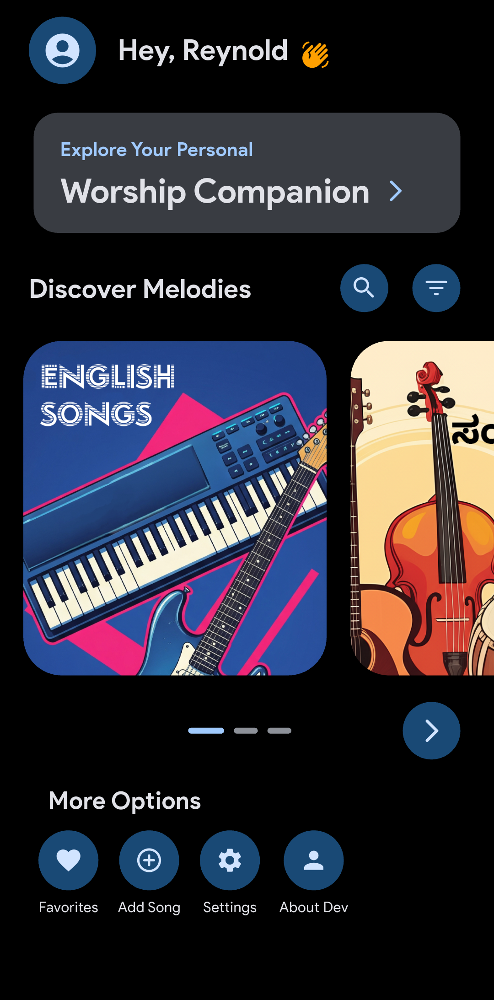
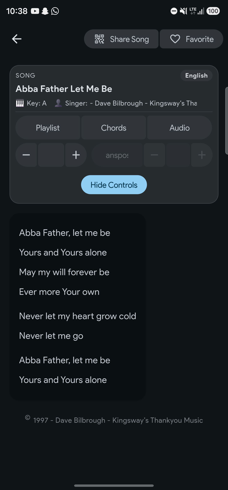

### Worship Companion

Worship Companion is an offline-first Flutter app for worship songs. Browse English and Kannada catalogs, search quickly, favorite songs, view chords, transpose keys, and customize your reading experience. Add new songs via AI-powered image scanning or manual entry, and submit them for review to grow the library.

#### 🚀 Features
- 🎵 Browsing and Search: English/Kannada catalogs, global search with filters and sorts
- 🇮🇳 Kannada Transliteration: Type Latin and find Kannada results
- ⭐ Favorites: Save songs; view by language; quick clear per tab
- 🎼 Chords and Transposition: Toggle chords and transpose in semitones
- 🔍 Readability: Adjustable font sizes; modern layout for live use
- 🎨 Theming: Material 3 dynamic color, custom seed color, AMOLED black, dark/light mode
- 🤖 AI Scan: OCR via Google Vision + parsing via Gemini to prefill manual song entry
- ☁️ Sync: Offline-first with encrypted local DB; background sync from Supabase; realtime for English updates
- 🔧 Dev Tools: In-app update checks (Android), clear local DBs

#### 💡 Project Overview
Read the full product spec in `docs/PRD.md`.

#### 📦 Installation
1) Prerequisites
- Flutter SDK (Dart >= 3.4.1)
- Supabase project (URL + ANON key)
- Google APIs: Vision + Gemini API keys

2) Clone and fetch packages
```bash
git clone "<your-repo-url>"
cd worshipcompanion
flutter pub get
```

3) Create `.env` in the project root
```bash
SUPABASE_URL=your-supabase-url
SUPABASE_ANON_KEY=your-supabase-anon-key
GOOGLE_VISION_API_KEY=your-google-vision-api-key
GEMINI_API_KEY=your-gemini-api-key
```

4) Run
```bash
flutter run
```

Notes:
- Ensure platform permissions for camera/photos are enabled (Android/iOS).
- If `.env` is missing or invalid, the app still runs offline with local data.

#### ⚙️ Usage
- Onboarding: Enter a name; optionally set a profile photo later from the home screen.
- Home: Tap English/Kannada cards to browse. Use the Search button for global search with filters/sorts.
- Favorites: Tap the heart on a song; access Favorites from “More Options”.
- Song Detail: Toggle chords on/off; use +/− to transpose; adjust font size via the floating action button.
- Add Songs:
  - AI Scan: Scan/pick an image; OCR + AI parsing prefill the manual form.
  - Manual: Type/paste lyrics; set metadata; submit to `pending_songs` for review.
- Settings: Choose theme style, custom color, dark mode, AMOLED black.
- Developer Options: Clear local encrypted DBs (useful during development).

#### 📸 Screenshots
Place screenshots under `assets/screenshots/` and reference them here.
- Home: assets/screenshots/homescreen.png
- Categories: assets/screenshots/categories.png
- English list: assets/screenshots/english-songs.png
- Kannada list: assets/screenshots/english-songs.png (or dedicated Kannada list shot)
- Song detail: assets/screenshots/detail-song.png
- Chords/transposition: assets/screenshots/chords.png
- Settings: assets/screenshots/settings.png
- Onboarding: assets/screenshots/onboarding.png

```md


```

#### 🧩 Tech Stack
- Flutter, Dart, Provider, Material 3 dynamic color
- Supabase (database, realtime)
- Encrypted local DB: SQLCipher via `sqflite_sqlcipher` + `flutter_secure_storage`
- OCR + LLM: Google Vision + Gemini
- Utilities: `connectivity_plus`, `shared_preferences`, `image_picker`, `image_cropper`, `permission_handler`, `inditrans`, `lottie`, `animated_text_kit`, `in_app_update`, `url_launcher`

#### 🧪 Testing
- Run tests:
```bash
flutter test
```
- Consider adding unit tests for:
  - Chord parsing/alignment (see `CHORD_FORMATTING_GUIDE.md`)
  - Transposition logic in `SongDetailScreen`
  - Local DB sync flows (mock SupabaseService)
  - Kannada transliteration search

#### 📁 Folder Structure
```text
lib/
  main.dart
  models/
    song_model.dart
  screens/
    home_page.dart
    onboarding_screen.dart
    song_list_screen.dart
    kannada_song_list_screen.dart
    song_detail_screen.dart
    add_song_options_screen.dart
    add_manual_song_screen.dart
    scan_song_screen.dart
    settings_page.dart
    about_developer.dart
  services/
    local_database_service.dart
    supabase_service.dart
    realtime_sync_service.dart
    gemini_service.dart
    vision_service.dart
  widgets/
    sliding_cards.dart
    song_card_widget.dart
    favorite_provider.dart
    theme_provider.dart
    snappy_transitions.dart
    card_model.dart
assets/
  cards/, onboarding/, icons/, animations/, fonts/, screenshots/
```

#### 🛡 License
This project is licensed under the MIT License. See `LICENSE` for details.

#### 🙋‍♂️ Contributing
- Open an issue describing the change/bug.
- Fork, create a feature branch, and submit a PR with a clear description.
- For new features, include screenshots and notes on UX decisions.
- Please do not commit secrets; use `.env` locally.

#### 🔗 Useful Links
- [Flutter](https://flutter.dev)
- [Supabase](https://supabase.com)
- [Google Vision](https://cloud.google.com/vision)
- [Gemini API](https://ai.google.dev)
- [Material 3 Dynamic Color](https://m3.material.io)
